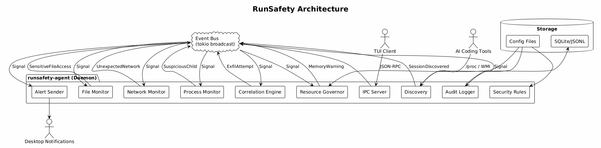
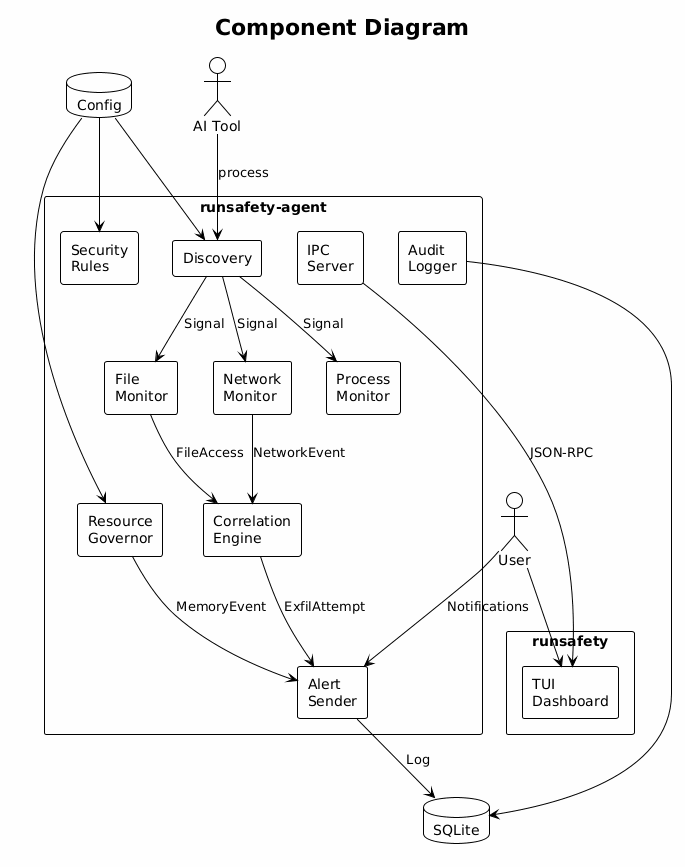

<div align="center">

# RunSafety

**Runtime security monitor for AI coding agents**

[](LICENSE)
[](https://www.rust-lang.org/)
[](#platform-support)
[](CONTRIBUTING.md)

---

AI coding tools run commands on your machine with broad permissions. **RunSafety** watches from the background and alerts you when something suspicious happens.

</div>

---

## Why RunSafety?

AI coding tools (Claude Code, Codex, Gemini CLI, Cursor, Aider, OpenCode) can:
- Read your SSH keys, AWS credentials, and `.env` files
- Make network connections to unknown servers
- Execute dangerous commands like `curl | sh`
- Consume all your memory and freeze your machine

**RunSafety detects all of this in real-time.**

---

## Features

<table>
<tr>
<td>

### File Monitoring
Detects reads of 30+ sensitive paths including SSH keys, AWS credentials, GPG keys, and environment files.

</td>
<td>

### Network Monitoring
Flags connections to hosts not on the allowlist. Correlates file access + network = exfiltration alert.

</td>
</tr>
<tr>
<td>

### Command Detection
Catches reverse shells, `curl | sh`, `chmod 777`, crontab edits, and privilege escalation attempts.

</td>
<td>

### Memory Governor
Enforces memory limits via cgroups v2. Tiered warnings before throttle or kill.

</td>
</tr>
<tr>
<td>

### Desktop Notifications
Get instant alerts without checking a dashboard.

</td>
<td>

### Audit Logging
SQLite database with query API for historical analysis.

</td>
</tr>
</table>

---

## Supported AI Tools

| Tool | Detection | Memory Limit |
|------|-----------|--------------|
| Claude Code | `claude`, `claude-code` | 3GB / 4GB |
| Codex | `codex`, `openai-codex` | 1.5GB / 2GB |
| Gemini CLI | `gemini`, `gemini-cli` | 2GB / 3GB |
| Cursor | `cursor-agent`, `cursor` | 3GB / 4GB |
| Aider | `aider` | 2GB / 3GB |
| OpenCode | `opencode`, `open-code` | 2GB / 3GB |
| Custom | Configurable in `agent.toml` | Configurable |

---

## Quick Start

### Install (Linux / macOS)

```bash
curl -sSf https://raw.githubusercontent.com/badie16/runsafety/main/dist/install.sh | sh
```

### Open Dashboard

```bash
runsafety
```

### Try Demo

```bash
runsafety demo
```

---

## Build from Source

```bash
# Clone
git clone https://github.com/badie16/runsafety.git
cd runsafety

# Build
cargo build --release

# Install
cp target/release/runsafety-agent target/release/runsafety ~/.local/bin/
mkdir -p ~/.config/runsafety
cp config/agent.toml config/security-rules.toml ~/.config/runsafety/
```

---

## Architecture

<div align="center">



</div>

---

## Component Diagram

<div align="center">



</div>

---

## Configuration

### agent.toml

```toml
[discovery]
scan_interval_secs = 5

[governor]
enabled = true
action = "throttle"  # warn | throttle | kill
warn_threshold = 0.85
urgent_threshold = 0.95

[governor.defaults]
memory_high = "2GB"
memory_max = "3GB"

[security]
enabled = true
scan_interval_secs = 3
exfil_window_secs = 10

[audit]
enabled = true
storage = "sqlite"  # jsonl | sqlite
retention_days = 90
```

### security-rules.toml

| Rule Type | Purpose |
|-----------|---------|
| `file_access` | Sensitive file paths to monitor |
| `network_allow` | Trusted hosts for network connections |
| `command_pattern` | Regex patterns for dangerous commands |

See [`config/security-rules.toml`](config/security-rules.toml) for the full default ruleset.

---

## Detection Rules

| Threat | Detection Method | OWASP |
|--------|------------------|-------|
| SSH/AWS/GPG key access | FD scanning + inotify | ASI-02 |
| Writes outside project | Boundary detection | ASI-01 |
| Unknown network connections | TCP parsing + allowlist | ASI-05 |
| Data exfiltration | File + network correlation | ASI-08 |
| Reverse shells, `curl \| sh` | Command pattern matching | ASI-10 |
| Suspicious child processes | Recursive /proc scan | ASI-10 |
| Memory leaks | Monotonic RSS growth | - |
| OOM kills | cgroup memory.events | - |

---

## Resource Governor

| Mode | memory.high | memory.max | Effect |
|------|-------------|------------|--------|
| `warn` | - | - | Desktop notifications only |
| `throttle` | set | - | Kernel throttles at soft limit **(default)** |
| `kill` | set | set | Hard OOM kill at max limit |

**Tiered alerts:** 85% warning → 95% urgent → 100% throttled → OOM killed

---

## Platform Support

| Platform | Status |
|----------|--------|
| Linux (x86_64) | Full support |
| Linux (aarch64) | Full support |
| macOS (Intel) | Full support |
| macOS (Apple Silicon) | Full support |
| Windows | In development |

---

## Contributing

Contributions welcome! See [CONTRIBUTING.md](CONTRIBUTING.md) for guidelines.

## License

Apache-2.0 - See [LICENSE](LICENSE) for details.

---

<div align="center">

**Built with Rust + Tokio + Ratatui**

</div>
